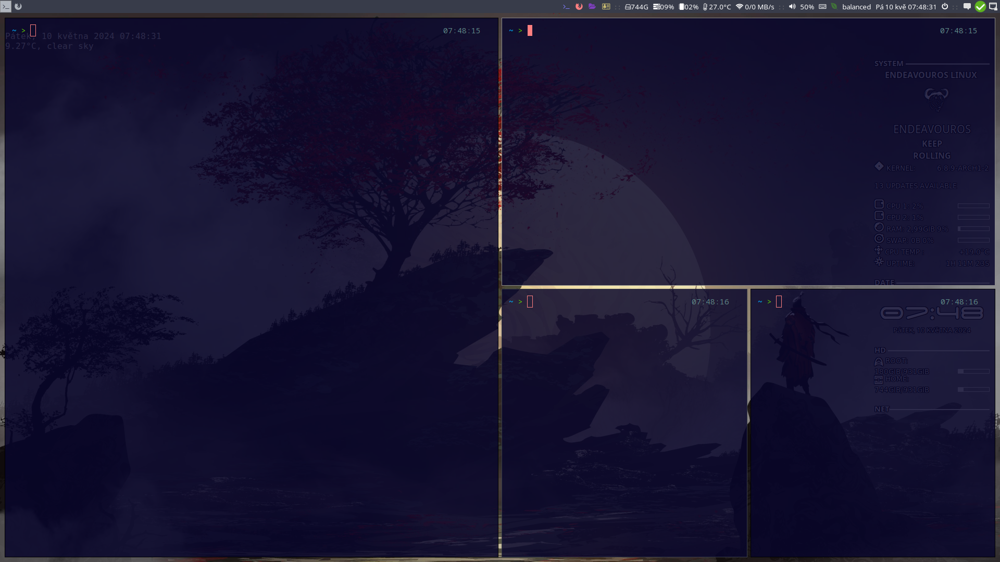

# Název Projektu - Rychlé instalace správce oken i3 pro Arch Linux

Tento projekt poskytuje skripty pro rychlou instalaci a konfiguraci základních aplikací a nástrojů nezbytných po instalaci Arch Linuxu. Hlavním cílem je ulehčit nastavení prostředí se správcem oken i3, aby byl váš systém ihned připraven k použití.



## Hlavní rysy

- **Automatizované Skripty**: Skripty pro jednoduchou a rychlou instalaci aplikací a nástrojů.
- **Konfigurace i3**: Přednastavené skripty pro konfiguraci i3, což zajišťuje, že váš spouštěcí systém bude ihned připraven k použití.

## Instalace

Pro stažení a instalaci projektu postupujte podle následujících kroků:

1. Klonujte repozitář:
   ```bash
   git clone https://git.arch-linux.cz/Archos/Archlinux_I3.git
    ```
2. Přejděte do adresáře repozitáře:
   ```bash
   cd Archlinux_I3
   ```
3. Nastavte skripty jako spustitelné pomocí následujících příkazů v kořenovém adresáři:
- Pro změnu oprávnění všech souborů s příponou `.sh` ve stávajícím adresáři:
  ```bash
  chmod +x *.sh
  ```
4. 
- Pro změnu oprávnění všech souborů s příponou `.sh` ve stávajícím adresáři i v podadresářích:
  ```bash
  find . -type f -name "*.sh" -exec chmod +x {} \;
  ```

## Popis skriptů a jejich instalace

 - **install_packages.sh** - Tento skript instaluje základní balíčky, které jsou potřebné pro systém a pro správné fungování správce oken i3. Seznam balíčků k instalaci je definován v 
 souboru  `packages-repository.txt`.

 Spustí se příkazem:

  ```bash
  ./install_packages.sh
   ```

- **install_yay.sh / install_paru.sh**

 - Tyto skripty jsou určeny pro instalaci balíčků z Arch User Repository (AUR). Každý skript nejprve ověří, zda je nainstalován `git` a příslušný pomocník pro AUR (`yay` nebo `paru`). Pokud nejsou nainstalovány, skript je automaticky nainstaluje.
 - Dále instaluje balíčky specifikované v proměnné `package_name`. Výchozí nastavení zahrnuje instalaci aplikací:
    - **autotiling** - Nástroj pro automatické přepínání orientace dlaždic v i3 nebo sway podle aktuálního layoutu.
    - **picom** - Kompozitní manažer pro Xorg, vylepšující vizuální výkon a poskytující efekty jako průhlednost a stínování oken.

Spustí se příkazem (v závislosti na vaší volbě):

```bash
./install_yay.sh
```
 nebo
 
```bash
./install_paru.sh
```

- **pacman_packages.sh** - Tento skript je určen pro instalaci širokého spektra aplikací, které osobně preferuji pro každodenní použití v Arch Linuxu. Seznam aplikací obsahuje esenciální nástroje jako Firefox a Vim, multimediální aplikace jako SMPlayer a VLC, nástroje pro správu souborů jako Thunar a PCManFM, kancelářský balík LibreOffice a mnoho dalších. Skript dále aktualizuje systém před instalací balíčků, aby zajistil, že jsou instalovány nejnovější dostupné verze. Skript je nastaven tak, aby nevyžadoval potvrzení během instalace, což zrychluje proces. 

  Skript je konfigurován pro snadnou úpravu, takže můžete přidat nebo odebrat aplikace podle vašich potřeb. Spustí se příkazem:
  ```bash
  ./pacman_packages.sh
   ```
 - **move_config_files.sh** Tento skript, automatizuje přesun konfiguračních souborů z naklonovaného repozitáře do odpovídajících složek v domovském adresáři.
 Upravte cesty: Upravte proměnné REPO_PATH a HOME_PATH tak, aby odpovídaly vašim cestám k naklonovanému repozitáři a vašemu domovskému adresáři.
Spusťte skript: Spusťte skript z terminálu příkazem 

```bash
  ./move_config_files.sh
```

## Automatická instalace a konfigurace

- Pro uživatele, kteří preferují rychlou a snadnou inicializaci svého prostředí s i3, je zde skript auto_install_i3.sh. Tento skript automatizuje několik klíčových kroků:

- Instalaci základních a doplňkových balíčků potřebných pro běh i3.
- Nastavení AUR helperu pro jednodušší správu balíčků z AUR.
- Přesun konfiguračních souborů do příslušných adresářů v uživatelově domovském adresáři.
- Konfiguraci programů jako dunst a rofi pro správu notifikací a spouštění aplikací.

### Jak používat skript auto_install_i3.sh

1. Stáhněte skript do vašeho systému pomocí příkazu:

```bash
wget https://git.arch-linux.cz/Archos/Archlinux_I3/raw/branch/main/auto_install_i3.sh
```
2. Nastavte skript jako spustitelný:

```bash
chmod +x auto_install_i3.sh
```
3. Spusťte skript:

```bash
./auto_install_i3.sh
```
Skript vám nabídne možnost upravit seznam balíčků před jejich instalací a zvolit mezi nástroji pro správu [AUR](https://wiki.archlinux.org/title/Arch_User_Repository), jako jsou Yay nebo Paru.
Po dokončení instalace

Po úspěšném dokončení instalace vás skript vyzve k restartování systému, aby byly změny aplikovány. Ujistěte se, že jste uložili všechny neuložené práce před restartováním systému.

### Čištění po instalaci

Skript nabízí možnost odstranit klonovaný repozitář a dočasné soubory, což uvolní prostor na disku. Toto je užitečné, pokud již neplánujete další úpravy nebo použití skriptů z tohoto repozitáře.

- Pokud si přejete repozitář smazat, odpovězte `y` na výzvu.
- Pokud si přejete repozitář ponechat pro budoucí použití nebo kontrolu, odpovězte `n`

```bash
Chcete smazat složku s repozitářem? (y/n)
```
## Struktura Konfigurační Složky
 
Projekt obsahuje klíčové konfigurační složky v adresáři .config, které jsou zásadní pro nastavení a personalizaci vašeho systému. Mnohé z těchto konfiguračních souborů jsou inspirovány nebo přímo převzaty z projektu EndeavourOS, což přináší osvědčené nastavení pro Arch Linux a jeho deriváty. Každá složka má specifický účel:

### `/dunst`
- **Účel**: Obsahuje konfigurační soubory pro `dunst`, což je démon pro zobrazení notifikací v systému. Umožňuje přizpůsobení vzhledu a chování notifikací.

### `/gtk-3.0`
- **Účel**: Tato složka obsahuje konfigurační soubory pro GTK+ 3 aplikace, což zahrnuje nastavení témat, ikon a dalších grafických prvků.

### `/i3`
- **Účel**: Hlavní konfigurační soubory pro správce oken i3. Zde naleznete soubory pro nastavení klávesových zkratek, vzhledu a dalších funkcí i3.

### `/i3/scripts`
- **Účel**: Skripty specifické pro i3, které mohou zahrnovat utility pro správu okenních uspořádání, automatické spouštění aplikací a další.

### `/nano`
- **Účel**: Konfigurační soubory pro textový editor Nano, včetně nastavení syntaxového zvýraznění a dalších editorových preferencí.

### `/rofi`
- **Účel**: Složka pro `rofi`, moderní zástupce tradičního dialogového okna pro spouštění programů. Obsahuje konfigurace, které definují vzhled a chování tohoto nástroje.

### `/xfce4/terminal`
- **Účel**: Nastavení pro terminál Xfce4, které umožňují přizpůsobení schémat barev, písma a dalších aspektů vzhledu terminálu.

## Použití


## Složka <a href="https://git.arch-linux.cz/Archos/Archlinux_I3/src/branch/main/utilities" target="_blank">utilities</a>

Tato složka obsahuje pomocné skripty, které rozšiřují funkcionalitu systému. Zde je přehled skriptů a jejich funkcí:

- **check_updates.sh**: Skript pro kontrolu dostupných aktualizací systému. Informuje uživatele o dostupných aktualizacích prostřednictvím terminálu. Skript můžete integrovat do Conky nebo i3blocks pro pravidelné zobrazování aktualizací.
Tento skript využívá nástroj checkupdates, který je součástí balíčku pacman-contrib v Arch Linuxu. Ujisti se, že je tento balíček nainstalován:

 ```bash
sudo pacman -S pacman-contrib
 ```

- **git_config.sh**: Nastavuje globální konfigurace Gitu, včetně jména uživatele, emailu a výchozího editoru, což usnadňuje správu verzí a práci s repozitáři.

- **system_updates.sh** - Tento skript slouží k pravidelnému aktualizování systému a aplikací v Arch Linuxu. Skript zkontroluje dostupné aktualizace a provede je bez uživatelského zásahu. Pro zajištění, že uživatel bude informován o průběhu aktualizace, skript může zobrazovat notifikace pomocí desktopového notifikačního systému.


### Integrace `check_updates.sh`

#### Conky

&#x2022; Pro zobrazení výstupu skriptu `check_updates.sh` v Conky, přidejte následující řádek do vašeho `.conkyrc` souboru:

 ```bash
${execi 600 /cesta/k/check_updates.sh}
 ```
#### i3blocks

&#x2022;Pro integraci výstupu skriptu update_check.sh do i3blocks, přidejte následující blok do vašeho konfiguračního souboru i3blocks:
 ```bash
[updates]
command=/cesta/k/skripty/check_updates
interval=600
 ```

 - **update_notifier.sh** - ## Detaily Skriptu

### update_notifier.sh
Tento skript kontroluje dostupné aktualizace pro systém Arch Linux a informuje uživatele pomocí desktopové notifikace. Skript je optimalizován pro spouštění z cronu, což vyžaduje speciální nastavení pro správnou funkčnost GUI notifikací:

- `export DBUS_SESSION_BUS_ADDRESS="unix:path=/run/user/1000/bus"`: Tento příkaz nastaví proměnnou prostředí, která umožňuje skriptu komunikovat s desktopovým prostředím uživatele a zobrazovat notifikace, i když je spuštěný z cronu. Bez této proměnné by skript v cronu nebyl schopen zobrazit GUI notifikace, protože cron typicky neběží v uživatelském desktopovém prostředí.

Tento řádek je klíčový pro zajištění, že skript bude moci interagovat s desktopovým prostředím a zobrazovat notifikace, i když je spuštěn z prostředí, které není připojeno k uživatelskému grafickému prostředí, jako je cron.

### Zjištění uživatele podle UID

Pro zjištění, který uživatel má UID 1000, můžete použít příkaz id s možností -nu pro zobrazení jména uživatele:

 ```bash
 id -nu 1000
 ```
Tento příkaz vám vrátí uživatelské jméno spojené s UID 1000.
Pro  zjištění aktuálního uživatelského ID (UID) přihlášeného uživatele můžete použít příkaz `echo $UID`. Tento příkaz vypíše UID uživatele, který je právě přihlášen a spouští skript nebo příkazovou řádku. Je to jednoduchý a přímý způsob, jak zjistit UID:

  ```bash
  echo $UID
  ```

 ### Nastavení periodických aktualizací pomocí crontab

 1. Otevřete `crontab` pro úpravy:
    ```bash
    crontab -e
    ```

2. Přidejte následující řádek pro spouštění system_updates.sh každou hodinu.

  ```bash
/59 * * * * /cesta/k/update_notifier.sh
  ```

### Přidání notifikací do i3 config

&#x2022; Chcete-li získat vizuální zpětnou vazbu prostřednictvím systémových notifikací, ujistěte se, že máte nainstalovaný a nakonfigurovaný nástroj pro notifikace, například dunst. Přidání spuštění dunst do i3 config může vypadat takto:

  ```bash
  exec_always --no-startup-id dunst

  ```

&#x2022;  Pro i3 window manager, můžete zahrnout skript pro automatické spuštění při startu i3, přidejte následující řádek do vaší konfiguračního souboru i3:

  ```bash
exec_always --no-startup-id /path/to/update_notifier.sh
  ```

### Spouštění aktualizací pomocí i3 klávesové zkratky
Ve složce `utilities` se nachází skript `update_yay.sh`, který slouží k automatickému spuštění aktualizací. Pro snadné použití přidejte následující zkratku do i3 konfiguračního souboru:
```bash
bindsym $mod+Shift+u exec ~/utilities/update_yay.sh
```
Tímto způsobem budete moci spustit aktualizace jednoduše pomocí klávesové zkratky.

### Nastavení tapety v i3 pomocí feh

Pro nastavení tapety na pracovní ploše i3 můžete použít nástroj feh. feh je lehký prohlížeč obrázků, který lze také použít k nastavení pozadí plochy.

#### Nastavení tapety

Uložení Obrázku: Nejprve umístěte obrázek, který chcete použít jako tapetu, do vhodné složky, například do ~/Pictures/Wallpapers.

Editace Konfiguračního Souboru i3: Otevřete konfigurační soubor i3, obvykle umístěný v ~/.config/i3/config.

Přidání Příkazu pro Nastavení Tapety: Přidejte následující řádek do konfiguračního souboru, který zajistí, že feh nastaví tapetu při každém spuštění i3. Náhradou path_to_your_wallpaper doplňte cestu k vašemu obrázku:

```bash
exec_always --no-startup-id feh --bg-scale /path_to_your_wallpaper
```

- **--bg-scale** zajistí, že obrázek bude přizpůsoben velikosti vaší obrazovky.
- **exec_always** znamená, že feh se spustí pokaždé, když i3 začne nebo se restartuje.


### Aplikace změn

Pro aplikaci změn restartujte i3. To můžete provést pomocí klávesové zkratky [mod+Shift+r] (mod klávesa obvykle odpovídá Windows klávese nebo Alt klávese, v závislosti na vaší konfiguraci).

### Co je Conky?

Conky je lehký monitorovací systém pro X Window System. Je navržen tak, aby byl maximálně efektivní, přizpůsobitelný a vzhledově příjemný. Conky dokáže zobrazovat informace prostřednictvím textového i grafického uživatelského rozhraní a lze ho snadno integrovat do mnoha desktopových prostředí, včetně i3.

#### Instalace Conky

Conky můžete nainstalovat pomocí správce balíčků vaší distribuce. Pro Arch Linux použijte:

```bash
 sudo pacman -S conky
```
    
#### Konfigurace Conky

Konfigurační soubory Conky jsou obvykle umístěny v ~/.config/conky/ nebo přímo v domovském adresáři uživatele jako ~/.conkyrc. Konfigurace Conky je velmi flexibilní – od jednoduchého textového výpisu po komplexní grafické ukazatele.

#### Spuštění Conky s i3

Pro automatické spuštění Conky při startu i3 můžete do vašeho konfiguračního souboru i3 (typicky ~/.config/i3/config) přidat následující řádek:

```bash 
exec_always --no-startup-id conky
```

Tento příkaz zajistí, že Conky bude spuštěno vždy po spuštění nebo restartu i3.
